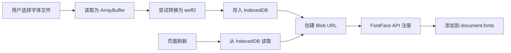
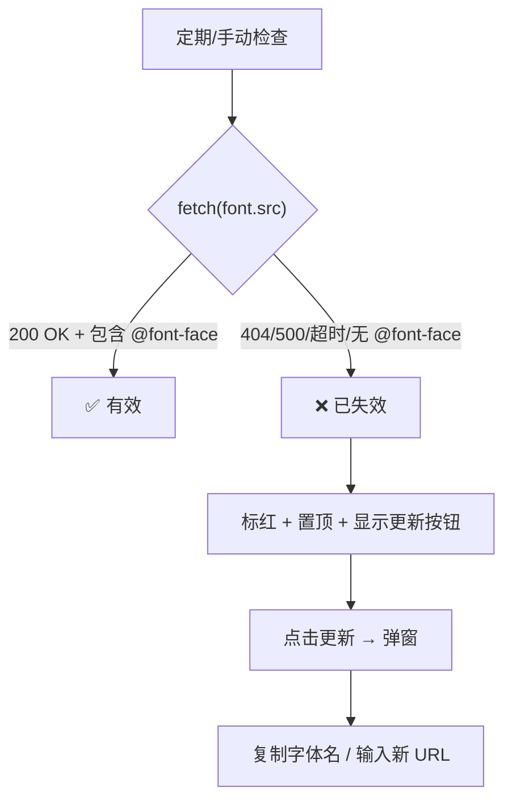

# 字体模块重构 & 美化面板优化 — 实施计划

## 一、架构变更

### 字体存储：从服务端上传 → IndexedDB + FontFace API



| 存储位置 | 存什么 |
|---|---|
| `extension_settings` (JSON) | 字体元数据：名称、ID、类型、标签、作用范围、字号等 |
| `IndexedDB` (`ggg-fonts` 数据库) | 字体二进制文件数据（ArrayBuffer），按 font ID 索引 |

> [!IMPORTANT]
> 不再使用 `/api/backgrounds/upload` 上传字体文件。`server-plugin` 文件夹已删除。

### 字体导入导出

导出格式：类似 UI 主题自定义的存档文件，包含元数据 + 字体二进制数据，可跨设备/浏览器导入使用。

### 上传优化

- 上传时自动尝试转换为 woff2 格式（体积更小）
- 转换失败则保留原始格式
- IndexedDB 容量满时提示用户需要删除字体才能继续上传

### 在线字体验证机制



---

## 二、UI 设计方案

### 美化面板 — 导航栏式布局（可扩展）

```
┌─────────────────────────────────────────────┐
│ [UI主题自定义]  [字体管理]  [未来...]         │  ← 导航栏（带动画下划线，可扩展）
├─────────────────────────────────────────────┤
│                                             │
│  (对应面板内容)                               │
│                                             │
└─────────────────────────────────────────────┘
```

### 字体管理面板布局

```
┌─────────────────────────────────────────────┐
│ [总开关: 启用字体管理]                        │
├─────────────────────────────────────────────┤
│ ▶ 使用说明 (可展开/折叠，默认折叠)             │
├─────────────────────────────────────────────┤
│ 🔤 正在使用的字体                             │
│ ┌──────┐ ┌──────┐ ┌──────┐                  │
│ │字体A  │ │字体B  │ │字体C  │                  │
│ └──────┘ └──────┘ └──────┘                  │
├─────────────────────────────────────────────┤
│ [+导入] [✏编辑] [排序▼] [📥导入] [📤导出]     │ ← 工具栏
├─────────────────────────────────────────────┤
│ [全部] [本地] [在线]                          │ ← 类型筛选
│ [Tag1] [Tag2] [Tag3] [Tag4] →→              │ ← Tag 横向滚动
├─────────────────────────────────────────────┤
│ ── Tag A ──                                  │
│  字体名A1 (用该字体渲染)    [全局][聊天] [▸]  │
│  字体名A2 (用该字体渲染)    [全局]       [▸]  │
│ ── Tag B ──                                  │
│  字体名B1 (用该字体渲染)    [消息]       [▸]  │
│                                             │
│  « 1  2  3 »                                 │ ← 分页 (7个/页)
├─────────────────────────────────────────────┤
│ ⚙ 高级 — 自定义选择器（自动对所有字体生效）     │
│  [+ 添加选择器]                              │
│  自定义名称1: .my-class  [×]                 │
│  自定义名称2: #chat .foo [×]                 │
└─────────────────────────────────────────────┘
```

---

## 三、实施步骤

### Phase 1: IndexedDB 字体存储 + FontFace API ✅ 进行中
- [x] 实现 IndexedDB 工具类（存/取/删字体二进制数据）— font-db.js
- [x] 删除 `server-plugin/` 文件夹
- [x] 删除 IndexedDB 存储量显示功能（无法精确显示仅 IndexedDB 用量）
- [ ] 字体导入重构：文件 → ArrayBuffer → woff2转换 → IndexedDB + Blob URL → FontFace API
- [ ] 页面加载时从 IndexedDB 恢复所有字体
- [ ] 删除字体时清理 IndexedDB + 清理 Blob URL
- [ ] 容量满时提示用户

### Phase 2: 字体导入/导出
- [ ] 导出：元数据 + 字体二进制打包为单文件（类似 UI 主题存档）
- [ ] 导入：解析存档文件 → 存入 IndexedDB + 恢复元数据

### Phase 3: 在线字体验证
- [ ] 检测在线字体有效性（fetch CSS URL）
- [ ] 无效字体标红 + 置顶
- [ ] 更新弹窗（复制字体名、输入新 URL）

### Phase 4: 美化面板 UI 重构
- [ ] 导航栏样式 + 动画（UI主题自定义 / 字体管理 / 未来扩展）
- [ ] UI主题自定义：总开关 + 使用说明
- [ ] 字体管理面板完整重做

### Phase 5: 字体面板功能
- [ ] 使用说明（可折叠，详细内容）
- [ ] 正在使用的字体展示
- [ ] 工具栏：导入按钮(弹窗)、编辑模式、排序、导入导出
- [ ] 编辑模式：单选/多选/全选 → 添加tag/删除tag/删除文件
- [ ] Tag 横向滚动导航
- [ ] 类型筛选（全部/本地/在线）
- [ ] 分页（7个/页）
- [ ] 字体按 tag首字母→字体名首字母 排序
- [ ] 高级：全局自定义选择器管理（自动对所有字体生效）

### Phase 6: 图库/头像库优化
- [ ] 图库"多选"改名为"编辑"
- [ ] 头像库添加编辑功能（与图库一致：单选/多选/全选/批量标签/批量删除）
- [ ] 图库编辑模式优化：删除按钮不再容易误触（只在编辑模式下显示，需确认）
- [ ] 图库图片不显示文件名
- [ ] 图库/头像库排序：tag首字母 → 上传顺序

---

## 四、已确认的设计决策

| 问题 | 决定 |
|---|---|
| 字体导出格式 | 类似 UI 主题自定义的存档文件，跨设备/浏览器可导入 |
| 字体数量/容量 | 容量满时提示用户需要删除字体；上传时自动转 woff2 优化体积 |
| 美化面板导航 | 可扩展设计，未来会有更多标签 |
| 编辑模式操作 | 单选/多选/全选 → 添加tag、删除tag、删除文件 |
| 全局高级选择器 | 自动对所有字体生效 |
| 图库多选 → 编辑 | 改名为"编辑"，头像库也添加编辑功能 |
| 图库删除按钮 | 优化防误触，仅在编辑模式显示或需二次确认 |
| IndexedDB 用量显示 | 已删除，无法精确显示仅 IndexedDB 的用量 |
